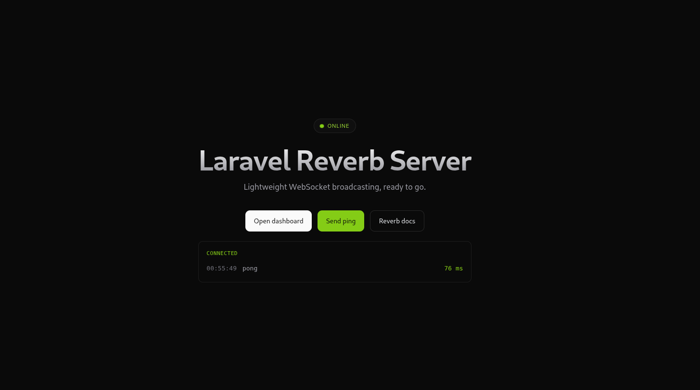
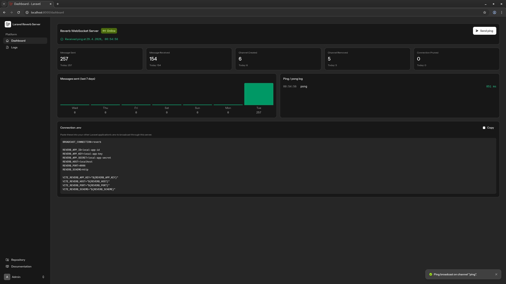
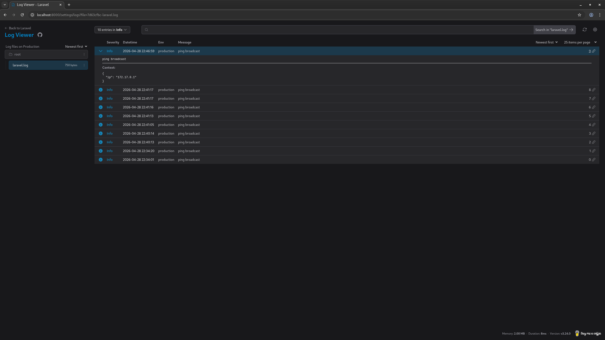

# Laravel Reverb Server

Self-hosted [Laravel Reverb](https://laravel.com/docs/reverb) in a single container — Pusher-protocol WebSocket broadcasting plus a small dashboard. Spin it up, point your apps at it, broadcast.


## Run it

```sh
docker run -d --restart unless-stopped --name reverb-server -p 8000:8000 -p 8080:8080 terjen/laravel-reverb-server solo
```

- Dashboard at <http://localhost:8000> · login `admin@admin.com` / `testing123`
- WebSocket at `ws://localhost:8080`
- Public welcome page at `/` with a no-auth Send-ping tester

`solo` runs Reverb and the dashboard in one container. Multi-arch image (`linux/amd64`, `linux/arm64`) is on [Docker Hub](https://hub.docker.com/r/terjen/laravel-reverb-server). For TLS-fronted production, see [`docs/PROD-DEPLOYMENT.md`](docs/PROD-DEPLOYMENT.md).

## Connect a Laravel app

In the consuming app's `.env`:

```env
BROADCAST_CONNECTION=reverb

REVERB_APP_ID=local-app-id
REVERB_APP_KEY=local-app-key
REVERB_APP_SECRET=local-app-secret
REVERB_HOST=localhost
REVERB_PORT=8080
REVERB_SCHEME=http

VITE_REVERB_APP_KEY="${REVERB_APP_KEY}"
VITE_REVERB_HOST="${REVERB_HOST}"
VITE_REVERB_PORT="${REVERB_PORT}"
VITE_REVERB_SCHEME="${REVERB_SCHEME}"
```

Then `composer require laravel/reverb && npm i -D laravel-echo pusher-js`, and broadcast as usual on `ShouldBroadcast` events. The dashboard's "Connection .env" panel shows the live values for whichever container is running.

## What's inside

- WebSocket server, Pusher-protocol — works with `laravel-echo` + `pusher-js` out of the box.
- Login-gated dashboard with reachability check, lifecycle counters (`MessageSent`, `MessageReceived`, `ChannelCreated`/`Removed`, `ConnectionPruned`), 7-day chart, ping/pong tester.
- Log viewer at `/settings/logs` ([opcodes/log-viewer](https://github.com/opcodesio/log-viewer)).
- `GET /api/stats` returns reachability + counters as JSON, no auth.
- Stats persisted to SQLite (WAL mode, idempotent migrations on boot).






## Develop

Clone, then:

```sh
make up
```

Spins up the two-container compose stack (FrankenPHP app + Reverb daemon), migrates, seeds, prints a copy-paste `.env` block. The `Makefile` lists the rest of the targets (logs, shell, tinker, fresh, test, pint).

Requires PHP 8.4 (Laravel 13).

## License

MIT.
